## All Cash Millions - $20.00

<table>
<tr><td>

|Prize|% Chance|
| ------------- |:-------------:|
|$20.00 | 12.24637%|
|$30.00 | 4.90145%|
|$50.00 | 4.90120%|
|$100.00 | 3.65818%|
|$150.00 | 0.53189%|
|$200.00 | 0.45138%|
|$500.00 | 0.24966%|
|$1,000.00 | 0.04907%|
|$2,500.00 | 0.00325%|
|$10,000.00 | 0.00162%|
|$50,000.00 | 0.00027%|
|$1,000,000.00 | 0.00005%|

</td><td>

	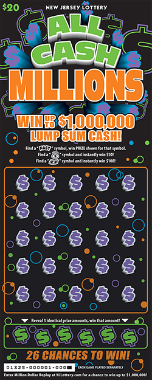
	

</td></tr> </table>

## Platinum Diamond Spectacular - $20.00

<table>
<tr><td>

|Prize|% Chance|
| ------------- |:-------------:|
|$20.00 | 7.27480%|
|$20.00 | 2.44863%|
|$20.00 | 6.07313%|
|$50.00 | 4.90839%|
|$70.00 | 3.94470%|
|$100.00 | 2.95367%|
|$500.00 | 0.36149%|
|$1,000.00 | 0.04550%|
|$2,000.00 | 0.01611%|
|$10,000.00 | 0.00158%|
|$1,554,300.00 | 0.00004%|

</td><td>

	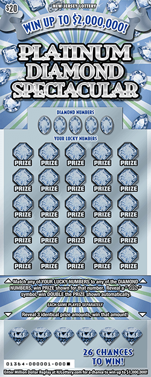
	

</td></tr> </table>

## $1,000,000 Spectacular - $10.00

<table>
<tr><td>

|Prize|% Chance|
| ------------- |:-------------:|
|$10.00 | 6.10309%|
|$10.00 | 6.09377%|
|$20.00 | 6.14774%|
|$40.00 | 1.54103%|
|$50.00 | 1.54632%|
|$100.00 | 1.67231%|
|$200.00 | 0.18565%|
|$500.00 | 0.04817%|
|$1,000.00 | 0.00764%|
|$2,000.00 | 0.00210%|
|$10,000.00 | 0.00038%|
|$777,150.00 | 0.00003%|

</td><td>

	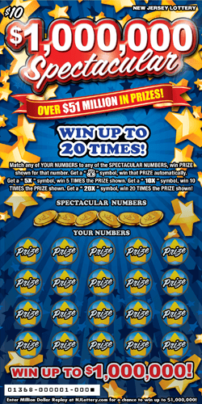
	

</td></tr> </table>

## $10K Blowout - $10.00

<table>
<tr><td>

|Prize|% Chance|
| ------------- |:-------------:|
|$10.00 | 10.04808%|
|$20.00 | 5.79100%|
|$30.00 | 2.90056%|
|$50.00 | 2.06920%|
|$100.00 | 0.52399%|
|$200.00 | 0.26240%|
|$500.00 | 0.04365%|
|$1,000.00 | 0.00181%|
|$5,000.00 | 0.00192%|
|$10,000.00 | 0.00202%|

</td><td>

	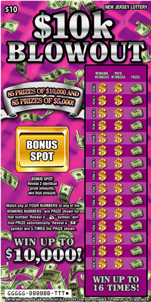
	

</td></tr> </table>

## Multiplier Mania - $10.00

<table>
<tr><td>

|Prize|% Chance|
| ------------- |:-------------:|
|$10.00 | 14.09889%|
|$20.00 | 4.73638%|
|$30.00 | 1.58598%|
|$50.00 | 3.17523%|
|$100.00 | 1.12716%|
|$200.00 | 0.03476%|
|$500.00 | 0.04830%|
|$1,000.00 | 0.00828%|
|$10,000.00 | 0.00059%|
|$500,000.00 | 0.00008%|

</td><td>

	
	

</td></tr> </table>

## Crossword - $3.00

<table>
<tr><td>

|Prize|% Chance|
| ------------- |:-------------:|
|$3.00 | 6.22320%|
|$5.00 | 5.73128%|
|$10.00 | 4.06827%|
|$25.00 | 2.91909%|
|$100.00 | 0.22676%|
|$500.00 | 0.00011%|
|$5,000.00 | 0.00015%|
|$20,000.00 | 0.00013%|

</td><td>

	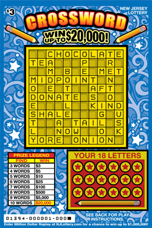
	

</td></tr> </table>

## Birthday Surprise - $2.00

<table>
<tr><td>

|Prize|% Chance|
| ------------- |:-------------:|
|$2.00 | 4.45802%|
|$2.00 | 4.31284%|
|$4.00 | 5.02836%|
|$5.00 | 1.66671%|
|$10.00 | 1.13865%|
|$20.00 | 1.15745%|
|$25.00 | 0.30770%|
|$50.00 | 0.12121%|
|$100.00 | 0.06565%|
|$500.00 | 0.00720%|
|$1,000.00 | 0.00051%|
|$25,000.00 | 0.00008%|

</td><td>

	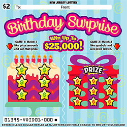
	

</td></tr> </table>

## Lucky 7s Doubler - $2.00

<table>
<tr><td>

|Prize|% Chance|
| ------------- |:-------------:|
|$2.00 | 8.83622%|
|$4.00 | 3.65226%|
|$5.00 | 1.79356%|
|$10.00 | 1.88545%|
|$15.00 | 1.25803%|
|$20.00 | 0.93427%|
|$50.00 | 0.25339%|
|$100.00 | 0.06258%|
|$1,000.00 | 0.00078%|
|$20,000.00 | 0.00004%|

</td><td>

	
	

</td></tr> </table>

## Lucky 7s Tripler - $5.00

<table>
<tr><td>

|Prize|% Chance|
| ------------- |:-------------:|
|$5.00 | 7.64709%|
|$10.00 | 9.42797%|
|$15.00 | 1.58027%|
|$20.00 | 1.58851%|
|$30.00 | 1.59347%|
|$50.00 | 0.37613%|
|$75.00 | 0.08154%|
|$100.00 | 0.16468%|
|$500.00 | 0.03188%|
|$1,000.00 | 0.00487%|
|$5,000.00 | 0.00102%|
|$200,000.00 | 0.00003%|

</td><td>

	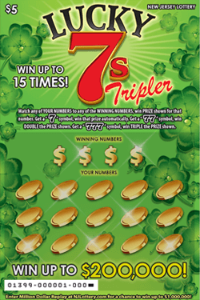
	

</td></tr> </table>

## Lucky 7s Multiplier - $10.00

<table>
<tr><td>

|Prize|% Chance|
| ------------- |:-------------:|
|$10.00 | 9.50744%|
|$15.00 | 3.17418%|
|$20.00 | 3.20449%|
|$25.00 | 3.18289%|
|$30.00 | 1.61544%|
|$50.00 | 3.25683%|
|$100.00 | 0.65315%|
|$200.00 | 0.11131%|
|$500.00 | 0.01631%|
|$1,000.00 | 0.00629%|
|$2,500.00 | 0.00185%|
|$10,000.00 | 0.00007%|
|$797,050.00 | 0.00007%|

</td><td>

	
	

</td></tr> </table>

## Loteria - $3.00

<table>
<tr><td>

|Prize|% Chance|
| ------------- |:-------------:|
|$3.00 | 10.09339%|
|$5.00 | 5.54501%|
|$10.00 | 2.79094%|
|$15.00 | 1.89502%|
|$20.00 | 1.39973%|
|$25.00 | 0.43450%|
|$30.00 | 0.10149%|
|$50.00 | 0.15826%|
|$100.00 | 0.03939%|
|$150.00 | 0.02786%|
|$500.00 | 0.01552%|
|$30,000.00 | 0.00007%|

</td><td>

	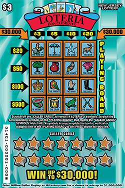
	

</td></tr> </table>

## Pocket Change - $1.00

<table>
<tr><td>

|Prize|% Chance|
| ------------- |:-------------:|
|$1.00 | 8.21012%|
|$2.00 | 6.13318%|
|$4.00 | 3.40868%|
|$10.00 | 0.57754%|
|$20.00 | 0.29054%|
|$40.00 | 0.07850%|
|$100.00 | 0.01814%|
|$500.00 | 0.00070%|

</td><td>

	
	

</td></tr> </table>

## Money Bags - $2.00

<table>
<tr><td>

|Prize|% Chance|
| ------------- |:-------------:|
|$2.00 | 5.89862%|
|$2.00 | 3.54660%|
|$4.00 | 5.83873%|
|$5.00 | 1.79667%|
|$10.00 | 2.40079%|
|$20.00 | 1.18140%|
|$40.00 | 0.24138%|
|$100.00 | 0.04543%|
|$500.00 | 0.00368%|
|$1,000.00 | 0.00040%|
|$20,000.00 | 0.00008%|

</td><td>

	
	

</td></tr> </table>

## Money Vault - $3.00

<table>
<tr><td>

|Prize|% Chance|
| ------------- |:-------------:|
|$3.00 | 10.22286%|
|$6.00 | 3.47187%|
|$9.00 | 1.74480%|
|$10.00 | 1.72067%|
|$15.00 | 1.74855%|
|$20.00 | 0.87534%|
|$30.00 | 0.35989%|
|$50.00 | 0.21836%|
|$100.00 | 0.10322%|
|$250.00 | 0.00373%|
|$1,000.00 | 0.00129%|
|$30,000.00 | 0.00005%|

</td><td>

	
	

</td></tr> </table>

## $5,000,000 Fortune - $30.00

<table>
<tr><td>

|Prize|% Chance|
| ------------- |:-------------:|
|$30.00 | 7.03725%|
|$30.00 | 4.71519%|
|$50.00 | 7.08146%|
|$60.00 | 2.35997%|
|$100.00 | 5.21678%|
|$200.00 | 1.44226%|
|$500.00 | 0.47514%|
|$1,000.00 | 0.04646%|
|$2,000.00 | 0.00705%|
|$5,000.00 | 0.00303%|
|$10,000.00 | 0.00028%|
|$50,000.00 | 0.00012%|
|$3,625,000.00 | 0.00003%|

</td><td>

	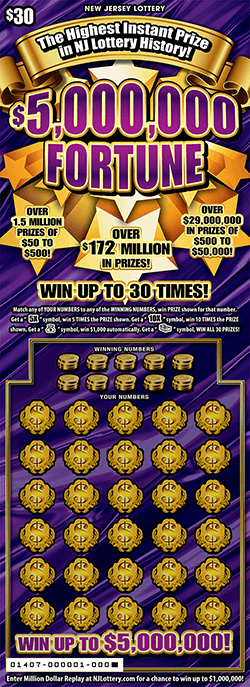
	

</td></tr> </table>

## $500 Money Madness - $5.00

<table>
<tr><td>

|Prize|% Chance|
| ------------- |:-------------:|
|$5.00 | 6.35639%|
|$10.00 | 11.28388%|
|$20.00 | 1.62376%|
|$25.00 | 0.48751%|
|$50.00 | 0.32583%|
|$100.00 | 0.22030%|
|$200.00 | 0.02395%|
|$500.00 | 0.13373%|
|$200,000.00 | 0.00006%|

</td><td>

	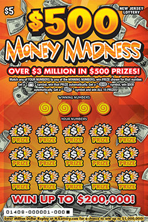
	

</td></tr> </table>

## Loteria - $3.00

<table>
<tr><td>

|Prize|% Chance|
| ------------- |:-------------:|
|$3.00 | 10.02829%|
|$5.00 | 5.49674%|
|$10.00 | 2.76737%|
|$15.00 | 1.89193%|
|$20.00 | 1.39584%|
|$25.00 | 0.43530%|
|$30.00 | 0.10139%|
|$50.00 | 0.15658%|
|$100.00 | 0.03804%|
|$150.00 | 0.02759%|
|$500.00 | 0.01590%|
|$30,000.00 | 0.00007%|

</td><td>

	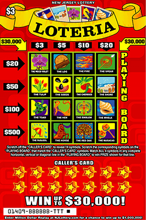
	

</td></tr> </table>

## Spring $50s - $2.00

<table>
<tr><td>

|Prize|% Chance|
| ------------- |:-------------:|
|$2.00 | 6.90946%|
|$2.00 | 3.70665%|
|$5.00 | 4.06594%|
|$10.00 | 1.64664%|
|$15.00 | 1.24221%|
|$20.00 | 0.24139%|
|$50.00 | 0.37119%|
|$100.00 | 0.06052%|
|$200.00 | 0.00559%|
|$1,000.00 | 0.00048%|
|$20,000.00 | 0.00006%|

</td><td>

	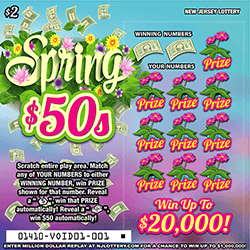
	

</td></tr> </table>

## Black and Gold - $5.00

<table>
<tr><td>

|Prize|% Chance|
| ------------- |:-------------:|
|$5.00 | 6.09126%|
|$10.00 | 7.45308%|
|$15.00 | 1.24389%|
|$20.00 | 1.25205%|
|$30.00 | 1.25379%|
|$50.00 | 0.27094%|
|$100.00 | 0.17009%|
|$500.00 | 0.02268%|
|$1,000.00 | 0.00431%|
|$5,000.00 | 0.00058%|
|$200,000.00 | 0.00003%|

</td><td>

	
	

</td></tr> </table>

## Super Crossword - $5.00

<table>
<tr><td>

|Prize|% Chance|
| ------------- |:-------------:|
|$5.00 | 8.85211%|
|$7.00 | 6.61185%|
|$10.00 | 2.19702%|
|$12.00 | 1.59514%|
|$15.00 | 0.31926%|
|$50.00 | 0.52039%|
|$100.00 | 0.65032%|
|$150.00 | 0.48315%|
|$750.00 | 0.00094%|
|$7,500.00 | 0.00029%|
|$50,000.00 | 0.00011%|

</td><td>

	
	

</td></tr> </table>

## Mega Crossword - $20.00

<table>
<tr><td>

|Prize|% Chance|
| ------------- |:-------------:|
|$20.00 | 6.99095%|
|$25.00 | 4.82500%|
|$30.00 | 4.79939%|
|$50.00 | 4.83301%|
|$75.00 | 1.35893%|
|$100.00 | 2.42726%|
|$150.00 | 0.56569%|
|$250.00 | 0.14233%|
|$500.00 | 0.27000%|
|$1,000.00 | 0.01593%|
|$2,000.00 | 0.00738%|
|$50,000.00 | 0.00063%|
|$500,000.00 | 0.00013%|

</td><td>

	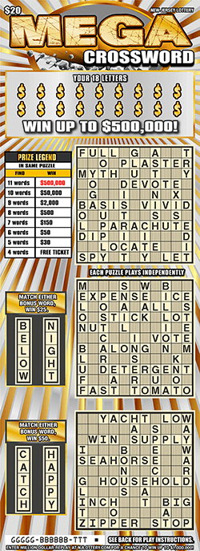
	

</td></tr> </table>

## Hot Spot Bingo - $5.00

<table>
<tr><td>

|Prize|% Chance|
| ------------- |:-------------:|
|$5.00 | 10.83766%|
|$10.00 | 6.30333%|
|$20.00 | 3.17233%|
|$50.00 | 1.17920%|
|$75.00 | 0.26836%|
|$100.00 | 0.13719%|
|$200.00 | 0.03344%|
|$400.00 | 0.00483%|
|$500.00 | 0.01260%|
|$1,000.00 | 0.00157%|
|$5,000.00 | 0.00070%|
|$30,000.00 | 0.00005%|
|$100,000.00 | 0.00007%|

</td><td>

	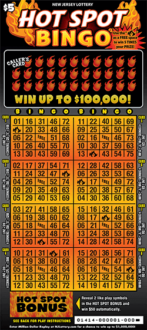
	

</td></tr> </table>

## $250,000 Crossword - $10.00

<table>
<tr><td>

|Prize|% Chance|
| ------------- |:-------------:|
|$10.00 | 9.10761%|
|$20.00 | 6.33458%|
|$25.00 | 0.95008%|
|$30.00 | 2.39712%|
|$50.00 | 3.51593%|
|$100.00 | 0.51218%|
|$130.00 | 0.07123%|
|$150.00 | 0.06237%|
|$225.00 | 0.03844%|
|$500.00 | 0.03197%|
|$525.00 | 0.03279%|
|$1,000.00 | 0.00065%|
|$20,000.00 | 0.00027%|
|$250,000.00 | 0.00016%|

</td><td>

	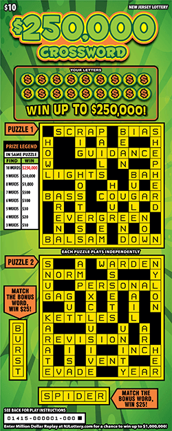
	

</td></tr> </table>

## Lucky Catch - $2.00

<table>
<tr><td>

|Prize|% Chance|
| ------------- |:-------------:|
|$2.00 | 7.79109%|
|$4.00 | 4.90128%|
|$5.00 | 2.11263%|
|$10.00 | 1.39043%|
|$20.00 | 0.83545%|
|$25.00 | 0.31591%|
|$50.00 | 0.16745%|
|$100.00 | 0.07106%|
|$500.00 | 0.00534%|
|$2,000.00 | 0.00050%|
|$20,000.00 | 0.00007%|

</td><td>

	
	

</td></tr> </table>

## Lady Luck - $5.00

<table>
<tr><td>

|Prize|% Chance|
| ------------- |:-------------:|
|$5.00 | 8.15605%|
|$10.00 | 9.50188%|
|$15.00 | 1.58609%|
|$20.00 | 1.59462%|
|$30.00 | 1.59789%|
|$50.00 | 0.38389%|
|$75.00 | 0.08030%|
|$100.00 | 0.14573%|
|$500.00 | 0.01928%|
|$1,000.00 | 0.00239%|
|$5,000.00 | 0.00047%|
|$250,000.00 | 0.00005%|

</td><td>

	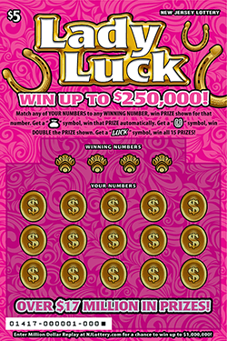
	

</td></tr> </table>

## $250,000 Crossword - $10.00

<table>
<tr><td>

|Prize|% Chance|
| ------------- |:-------------:|
|$10.00 | 8.94749%|
|$20.00 | 6.25382%|
|$25.00 | 0.93415%|
|$30.00 | 2.36419%|
|$50.00 | 3.47231%|
|$100.00 | 0.50594%|
|$130.00 | 0.07137%|
|$150.00 | 0.06158%|
|$225.00 | 0.03770%|
|$500.00 | 0.03151%|
|$525.00 | 0.03157%|
|$1,000.00 | 0.00061%|
|$20,000.00 | 0.00028%|
|$250,000.00 | 0.00017%|

</td><td>

	
	

</td></tr> </table>

## Big Money Spectacular - $2.00

<table>
<tr><td>

|Prize|% Chance|
| ------------- |:-------------:|
|$2.00 | 9.12790%|
|$3.00 | 3.16087%|
|$4.00 | 1.90229%|
|$5.00 | 1.58737%|
|$10.00 | 1.27405%|
|$15.00 | 1.28000%|
|$20.00 | 0.79896%|
|$25.00 | 0.48059%|
|$50.00 | 0.22387%|
|$75.00 | 0.04341%|
|$100.00 | 0.05898%|
|$500.00 | 0.00195%|
|$1,000.00 | 0.00031%|
|$5,000.00 | 0.00002%|
|$30,000.00 | 0.00004%|

</td><td>

	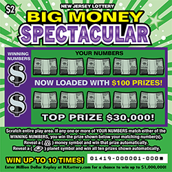
	

</td></tr> </table>

## Win For Life - $3.00

<table>
<tr><td>

|Prize|% Chance|
| ------------- |:-------------:|
|$3.00 | 4.18525%|
|$3.00 | 4.14127%|
|$5.00 | 2.52756%|
|$10.00 | 3.46887%|
|$15.00 | 0.43725%|
|$20.00 | 1.67990%|
|$30.00 | 0.50620%|
|$40.00 | 0.16115%|
|$100.00 | 0.07288%|
|$200.00 | 0.00432%|
|$1,000.00 | 0.00024%|
|$5,000.00 | 0.00013%|
|$1,380,000.00 | 0.00002%|

</td><td>

	
	

</td></tr> </table>

## Super Crossword - $5.00

<table>
<tr><td>

|Prize|% Chance|
| ------------- |:-------------:|
|$5.00 | 8.90551%|
|$7.00 | 6.63993%|
|$10.00 | 2.20661%|
|$12.00 | 1.60088%|
|$15.00 | 0.32098%|
|$50.00 | 0.52257%|
|$100.00 | 0.65216%|
|$150.00 | 0.48319%|
|$750.00 | 0.00092%|
|$7,500.00 | 0.00029%|
|$50,000.00 | 0.00009%|

</td><td>

	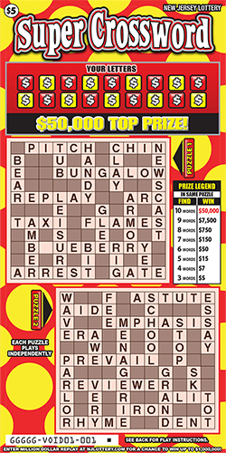
	

</td></tr> </table>

## 100X The Bucks - $20.00

<table>
<tr><td>

|Prize|% Chance|
| ------------- |:-------------:|
|$20.00 | 6.94487%|
|$20.00 | 6.93552%|
|$30.00 | 4.62901%|
|$50.00 | 4.65985%|
|$100.00 | 2.84372%|
|$200.00 | 0.70672%|
|$500.00 | 0.35118%|
|$1,000.00 | 0.02570%|
|$2,000.00 | 0.01107%|
|$10,000.00 | 0.00091%|
|$1,458,000.00 | 0.00004%|

</td><td>

	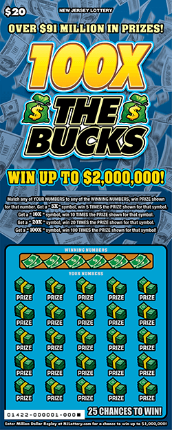
	

</td></tr> </table>

## Double $$ - $1.00

<table>
<tr><td>

|Prize|% Chance|
| ------------- |:-------------:|
|$1.00 | 7.52641%|
|$2.00 | 5.74965%|
|$3.00 | 0.25746%|
|$5.00 | 1.30897%|
|$10.00 | 0.92747%|
|$20.00 | 0.26388%|
|$50.00 | 0.07526%|
|$100.00 | 0.01228%|
|$500.00 | 0.00110%|
|$2,000.00 | 0.00006%|

</td><td>

	
	

</td></tr> </table>

## Liberty Bill$ - $2.00

<table>
<tr><td>

|Prize|% Chance|
| ------------- |:-------------:|
|$2.00 | 7.92344%|
|$3.00 | 5.11024%|
|$5.00 | 2.57772%|
|$10.00 | 1.31439%|
|$20.00 | 1.75884%|
|$40.00 | 0.26634%|
|$100.00 | 0.04471%|
|$500.00 | 0.00290%|
|$1,500.00 | 0.00048%|
|$20,000.00 | 0.00007%|

</td><td>

	
	

</td></tr> </table>

## All Cash Club - $5.00

<table>
<tr><td>

|Prize|% Chance|
| ------------- |:-------------:|
|$10.00 | 6.09274%|
|$15.00 | 3.05289%|
|$25.00 | 1.53080%|
|$50.00 | 1.07243%|
|$100.00 | 0.57850%|
|$150.00 | 0.06978%|
|$200.00 | 0.06194%|
|$250.00 | 0.04128%|

</td><td>

	
	

</td></tr> </table>

## Birthday Surprise - $2.00

<table>
<tr><td>

|Prize|% Chance|
| ------------- |:-------------:|
|$2.00 | 4.36720%|
|$2.00 | 4.30412%|
|$4.00 | 4.98126%|
|$5.00 | 1.66912%|
|$10.00 | 1.13814%|
|$20.00 | 1.15535%|
|$25.00 | 0.30813%|
|$50.00 | 0.12194%|
|$100.00 | 0.06690%|
|$500.00 | 0.00714%|
|$1,000.00 | 0.00054%|
|$25,000.00 | 0.00008%|

</td><td>

	
	

</td></tr> </table>

## Super Crossword - $5.00

<table>
<tr><td>

|Prize|% Chance|
| ------------- |:-------------:|
|$5.00 | 8.90631%|
|$7.00 | 6.61705%|
|$10.00 | 2.20080%|
|$12.00 | 1.59385%|
|$15.00 | 0.31844%|
|$50.00 | 0.52118%|
|$100.00 | 0.64786%|
|$150.00 | 0.48392%|
|$750.00 | 0.00094%|
|$7,500.00 | 0.00025%|
|$50,000.00 | 0.00009%|

</td><td>

	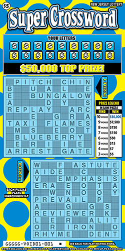
	

</td></tr> </table>

## Cash In A Flash - $10.00

<table>
<tr><td>

|Prize|% Chance|
| ------------- |:-------------:|
|$20.00 | 4.82885%|
|$25.00 | 1.60663%|
|$40.00 | 2.42417%|
|$50.00 | 1.61010%|
|$100.00 | 2.42314%|
|$200.00 | 0.24232%|
|$500.00 | 0.04832%|

</td><td>

	
	

</td></tr> </table>

## Double Match - $2.00

<table>
<tr><td>

|Prize|% Chance|
| ------------- |:-------------:|
|$2.00 | 8.78622%|
|$3.00 | 4.67912%|
|$5.00 | 2.16534%|
|$10.00 | 1.27996%|
|$20.00 | 1.25242%|
|$30.00 | 0.30041%|
|$50.00 | 0.16954%|
|$75.00 | 0.05502%|
|$200.00 | 0.00402%|
|$500.00 | 0.00249%|
|$2,000.00 | 0.00032%|
|$20,000.00 | 0.00008%|

</td><td>

	
	

</td></tr> </table>

## Power Play Crossword - $3.00

<table>
<tr><td>

|Prize|% Chance|
| ------------- |:-------------:|
|$3.00 | 7.18542%|
|$5.00 | 3.80099%|
|$6.00 | 1.80533%|
|$9.00 | 1.80830%|
|$10.00 | 1.91226%|
|$12.00 | 0.90539%|
|$15.00 | 0.92987%|
|$20.00 | 0.23891%|
|$25.00 | 0.32121%|
|$50.00 | 0.12077%|
|$75.00 | 0.12067%|
|$100.00 | 0.20134%|
|$200.00 | 0.04816%|
|$300.00 | 0.01633%|
|$500.00 | 0.00291%|
|$1,000.00 | 0.00194%|
|$5,000.00 | 0.00032%|
|$30,000.00 | 0.00011%|

</td><td>

	
	

</td></tr> </table>

## Super Casino - $5.00

<table>
<tr><td>

|Prize|% Chance|
| ------------- |:-------------:|
|$5.00 | 7.53676%|
|$10.00 | 6.80801%|
|$15.00 | 1.40367%|
|$20.00 | 1.36345%|
|$30.00 | 1.12762%|
|$50.00 | 0.61603%|
|$100.00 | 0.23822%|
|$500.00 | 0.01688%|
|$2,000.00 | 0.00494%|
|$150,000.00 | 0.00005%|

</td><td>

	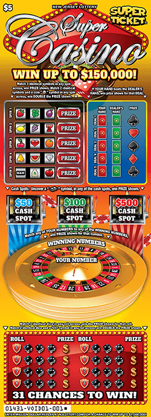
	

</td></tr> </table>

## $500,000 Riches - $10.00

<table>
<tr><td>

|Prize|% Chance|
| ------------- |:-------------:|
|$10.00 | 12.12001%|
|$20.00 | 1.22803%|
|$30.00 | 1.23286%|
|$40.00 | 1.24311%|
|$50.00 | 2.59530%|
|$100.00 | 0.49529%|
|$200.00 | 0.18599%|
|$500.00 | 0.02000%|
|$1,000.00 | 0.00470%|
|$5,000.00 | 0.00100%|
|$500,000.00 | 0.00005%|

</td><td>

	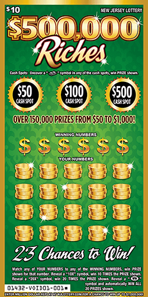
	

</td></tr> </table>

## Big Money Spectacular - $2.00

<table>
<tr><td>

|Prize|% Chance|
| ------------- |:-------------:|
|$2.00 | 8.99383%|
|$3.00 | 3.11443%|
|$4.00 | 1.87328%|
|$5.00 | 1.56223%|
|$10.00 | 1.25648%|
|$15.00 | 1.26206%|
|$20.00 | 0.78567%|
|$25.00 | 0.47305%|
|$50.00 | 0.22079%|
|$75.00 | 0.04285%|
|$100.00 | 0.05753%|
|$500.00 | 0.00195%|
|$1,000.00 | 0.00030%|
|$5,000.00 | 0.00002%|
|$30,000.00 | 0.00004%|

</td><td>

	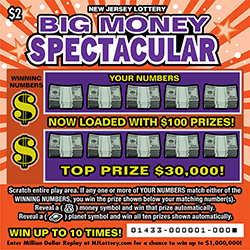
	

</td></tr> </table>

## Instant Bingo - $2.00

<table>
<tr><td>

|Prize|% Chance|
| ------------- |:-------------:|
|$2.00 | 11.95492%|
|$4.00 | 3.59004%|
|$5.00 | 3.43629%|
|$7.00 | 0.59982%|
|$9.00 | 0.30401%|
|$10.00 | 0.58528%|
|$12.00 | 0.60376%|
|$17.00 | 0.60808%|
|$20.00 | 0.63230%|
|$50.00 | 0.15606%|
|$100.00 | 0.03559%|
|$165.00 | 0.00314%|
|$500.00 | 0.00158%|
|$1,000.00 | 0.00018%|
|$15,000.00 | 0.00017%|

</td><td>

	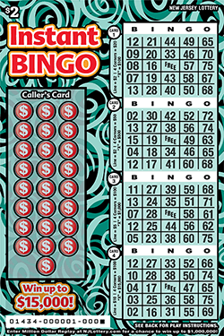
	

</td></tr> </table>

## Sizzlin Hot 7s - $2.00

<table>
<tr><td>

|Prize|% Chance|
| ------------- |:-------------:|
|$2.00 | 8.70781%|
|$3.00 | 3.50370%|
|$5.00 | 1.76656%|
|$7.00 | 1.32716%|
|$10.00 | 0.89097%|
|$17.00 | 1.78619%|
|$20.00 | 0.59530%|
|$50.00 | 0.17907%|
|$100.00 | 0.05198%|
|$500.00 | 0.00282%|
|$17,777.00 | 0.00004%|

</td><td>

	
	

</td></tr> </table>

## High Card Poker - $5.00

<table>
<tr><td>

|Prize|% Chance|
| ------------- |:-------------:|
|$5.00 | 0.47794%|
|$10.00 | 0.40081%|
|$20.00 | 0.16221%|
|$50.00 | 0.05764%|
|$100.00 | 0.01598%|
|$250.00 | 0.00144%|
|$500.00 | 0.00108%|
|$2,500.00 | 0.00002%|
|$150,000.00 | 0.00000%|

</td><td>

	
	

</td></tr> </table>

## $200 Million Cash Bonanza - $30.00

<table>
<tr><td>

|Prize|% Chance|
| ------------- |:-------------:|
|$30.00 | 4.81193%|
|$50.00 | 6.45965%|
|$75.00 | 3.22500%|
|$100.00 | 0.92964%|
|$200.00 | 2.15816%|
|$500.00 | 0.21817%|
|$2,000.00 | 0.00664%|
|$5,000.00 | 0.00160%|
|$10,000.00 | 0.00018%|
|$50,000.00 | 0.00006%|
|$3,679,200.00 | 0.00002%|

</td><td>

	
	

</td></tr> </table>

## Crossword - $3.00

<table>
<tr><td>

|Prize|% Chance|
| ------------- |:-------------:|
|$3.00 | 6.24565%|
|$5.00 | 5.73958%|
|$10.00 | 4.07127%|
|$25.00 | 2.92283%|
|$100.00 | 0.22685%|
|$500.00 | 0.00012%|
|$5,000.00 | 0.00013%|
|$20,000.00 | 0.00013%|

</td><td>

	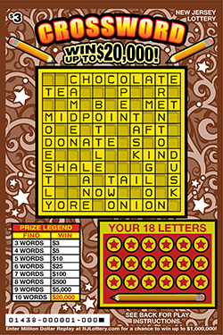
	

</td></tr> </table>

## Pocket Change - $1.00

<table>
<tr><td>

|Prize|% Chance|
| ------------- |:-------------:|
|$1.00 | 8.37040%|
|$2.00 | 6.25852%|
|$4.00 | 3.46783%|
|$10.00 | 0.58674%|
|$20.00 | 0.29663%|
|$40.00 | 0.08026%|
|$100.00 | 0.01827%|
|$500.00 | 0.00066%|

</td><td>

	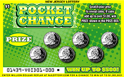
	

</td></tr> </table>

## Instant Bingo - $2.00

<table>
<tr><td>

|Prize|% Chance|
| ------------- |:-------------:|
|$2.00 | 11.90912%|
|$4.00 | 3.57240%|
|$5.00 | 3.41338%|
|$7.00 | 0.59769%|
|$9.00 | 0.30167%|
|$10.00 | 0.58034%|
|$12.00 | 0.60112%|
|$17.00 | 0.60707%|
|$20.00 | 0.63361%|
|$50.00 | 0.15788%|
|$100.00 | 0.03619%|
|$165.00 | 0.00287%|
|$500.00 | 0.00157%|
|$1,000.00 | 0.00018%|
|$15,000.00 | 0.00013%|

</td><td>

	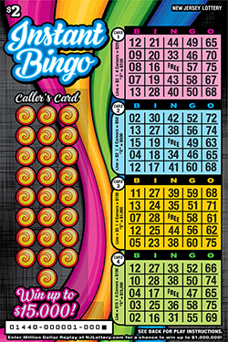
	

</td></tr> </table>

## 5x The Bucks - $1.00

<table>
<tr><td>

|Prize|% Chance|
| ------------- |:-------------:|
|$1.00 | 7.60886%|
|$2.00 | 6.97991%|
|$3.00 | 1.10677%|
|$5.00 | 0.88842%|
|$10.00 | 0.55663%|
|$20.00 | 0.45709%|
|$25.00 | 0.11768%|
|$40.00 | 0.05380%|
|$50.00 | 0.04257%|
|$100.00 | 0.00481%|
|$500.00 | 0.00078%|
|$10,000.00 | 0.00010%|

</td><td>

	
	

</td></tr> </table>

## 10x The Bucks - $2.00

<table>
<tr><td>

|Prize|% Chance|
| ------------- |:-------------:|
|$2.00 | 9.09943%|
|$4.00 | 3.69375%|
|$5.00 | 1.84489%|
|$10.00 | 1.87397%|
|$15.00 | 1.25860%|
|$20.00 | 0.94173%|
|$50.00 | 0.25206%|
|$100.00 | 0.06345%|
|$1,000.00 | 0.00074%|
|$20,000.00 | 0.00005%|

</td><td>

	
	

</td></tr> </table>

## 20x The Bucks - $5.00

<table>
<tr><td>

|Prize|% Chance|
| ------------- |:-------------:|
|$5.00 | 7.85256%|
|$10.00 | 9.62957%|
|$15.00 | 1.60465%|
|$20.00 | 1.20835%|
|$30.00 | 1.61906%|
|$50.00 | 0.44457%|
|$100.00 | 0.18458%|
|$500.00 | 0.03256%|
|$1,000.00 | 0.00324%|
|$5,000.00 | 0.00158%|
|$200,000.00 | 0.00007%|

</td><td>

	
	

</td></tr> </table>

## 50x The Bucks - $10.00

<table>
<tr><td>

|Prize|% Chance|
| ------------- |:-------------:|
|$10.00 | 11.00609%|
|$20.00 | 5.57765%|
|$40.00 | 2.09855%|
|$50.00 | 2.10562%|
|$100.00 | 1.04189%|
|$200.00 | 0.08592%|
|$500.00 | 0.03620%|
|$1,000.00 | 0.00162%|
|$10,000.00 | 0.00020%|
|$737,400.00 | 0.00001%|

</td><td>

	
	

</td></tr> </table>

## Hit $100! - $2.00

<table>
<tr><td>

|Prize|% Chance|
| ------------- |:-------------:|
|$2.00 | 8.16312%|
|$4.00 | 5.92251%|
|$5.00 | 2.95980%|
|$10.00 | 1.20236%|
|$20.00 | 0.60256%|
|$50.00 | 0.11022%|
|$100.00 | 0.24980%|
|$400.00 | 0.00292%|
|$1,000.00 | 0.00108%|
|$20,000.00 | 0.00006%|

</td><td>

	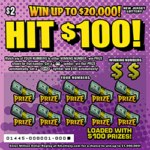
	

</td></tr> </table>

## Diamonds and Dollars - $5.00

<table>
<tr><td>

|Prize|% Chance|
| ------------- |:-------------:|
|$5.00 | 6.91343%|
|$10.00 | 8.40179%|
|$15.00 | 1.40304%|
|$20.00 | 2.81512%|
|$50.00 | 0.35066%|
|$100.00 | 0.22863%|
|$200.00 | 0.04219%|
|$500.00 | 0.02119%|
|$2,000.00 | 0.00110%|
|$10,000.00 | 0.00043%|
|$200,000.00 | 0.00005%|

</td><td>

	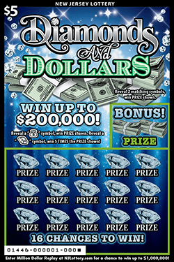
	

</td></tr> </table>

## Cash Bash - $10.00

<table>
<tr><td>

|Prize|% Chance|
| ------------- |:-------------:|
|$20.00 | 4.53964%|
|$25.00 | 1.51332%|
|$40.00 | 2.28136%|
|$50.00 | 1.51731%|
|$100.00 | 2.28330%|
|$200.00 | 0.22788%|
|$500.00 | 0.04593%|

</td><td>

	
	

</td></tr> </table>

## Crossword - $3.00

<table>
<tr><td>

|Prize|% Chance|
| ------------- |:-------------:|
|$3.00 | 6.19364%|
|$5.00 | 5.69162%|
|$10.00 | 4.03526%|
|$25.00 | 2.89730%|
|$100.00 | 0.22432%|
|$500.00 | 0.00012%|
|$5,000.00 | 0.00015%|
|$20,000.00 | 0.00014%|

</td><td>

	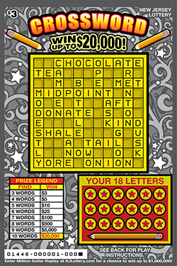
	

</td></tr> </table>

## Holiday Sparkle - $1.00

<table>
<tr><td>

|Prize|% Chance|
| ------------- |:-------------:|
|$1.00 | 6.96895%|
|$1.00 | 2.40696%|
|$2.00 | 4.09073%|
|$5.00 | 1.82049%|
|$10.00 | 0.91085%|
|$20.00 | 0.27849%|
|$40.00 | 0.08410%|
|$100.00 | 0.00826%|
|$500.00 | 0.00067%|
|$2,000.00 | 0.00009%|

</td><td>

	
	

</td></tr> </table>

## Holiday Lucky Times 10 - $2.00

<table>
<tr><td>

|Prize|% Chance|
| ------------- |:-------------:|
|$2.00 | 5.37624%|
|$2.00 | 3.22048%|
|$4.00 | 5.43923%|
|$5.00 | 1.64818%|
|$10.00 | 2.23531%|
|$20.00 | 1.13170%|
|$50.00 | 0.18185%|
|$100.00 | 0.04337%|
|$500.00 | 0.00281%|
|$1,000.00 | 0.00036%|
|$20,000.00 | 0.00010%|

</td><td>

	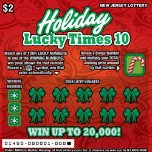
	

</td></tr> </table>

## Holiday Spectacular - $5.00

<table>
<tr><td>

|Prize|% Chance|
| ------------- |:-------------:|
|$5.00 | 7.24351%|
|$10.00 | 9.48957%|
|$20.00 | 3.00738%|
|$50.00 | 0.42631%|
|$100.00 | 0.34452%|
|$400.00 | 0.04629%|
|$1,000.00 | 0.00390%|
|$5,000.00 | 0.00069%|
|$200,000.00 | 0.00005%|

</td><td>

	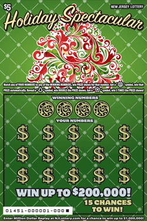
	

</td></tr> </table>

## $10,000 Bonus - $10.00

<table>
<tr><td>

|Prize|% Chance|
| ------------- |:-------------:|
|$10.00 | 9.83337%|
|$20.00 | 5.65988%|
|$30.00 | 2.83445%|
|$50.00 | 2.40180%|
|$100.00 | 0.25686%|
|$200.00 | 0.22693%|
|$500.00 | 0.04270%|
|$2,000.00 | 0.00175%|
|$5,000.00 | 0.00115%|
|$10,000.00 | 0.00334%|

</td><td>

	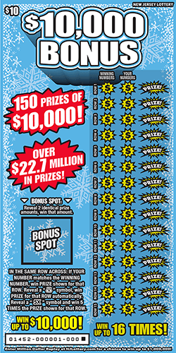
	

</td></tr> </table>

## $250,000 Crossword - $10.00

<table>
<tr><td>

|Prize|% Chance|
| ------------- |:-------------:|
|$10.00 | 9.06237%|
|$20.00 | 6.30918%|
|$25.00 | 0.94588%|
|$30.00 | 2.38291%|
|$50.00 | 3.50111%|
|$100.00 | 0.50875%|
|$130.00 | 0.07079%|
|$150.00 | 0.06198%|
|$225.00 | 0.03888%|
|$500.00 | 0.03107%|
|$525.00 | 0.03135%|
|$1,000.00 | 0.00061%|
|$20,000.00 | 0.00028%|
|$250,000.00 | 0.00011%|

</td><td>

	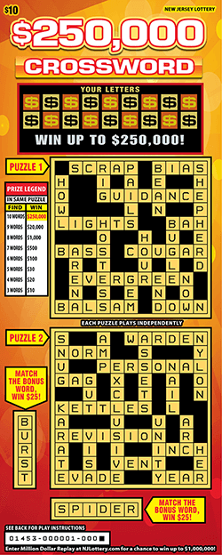
	

</td></tr> </table>

## $150,000 Poker - $5.00

<table>
<tr><td>

|Prize|% Chance|
| ------------- |:-------------:|
|$5.00 | 9.29258%|
|$10.00 | 7.84555%|
|$20.00 | 3.15871%|
|$50.00 | 1.12824%|
|$100.00 | 0.31166%|
|$250.00 | 0.03187%|
|$500.00 | 0.01944%|
|$2,500.00 | 0.00119%|
|$150,000.00 | 0.00007%|

</td><td>

	
	

</td></tr> </table>

## Double Win - $3.00

<table>
<tr><td>

|Prize|% Chance|
| ------------- |:-------------:|
|$3.00 | 7.26681%|
|$4.00 | 2.73103%|
|$5.00 | 2.74652%|
|$6.00 | 1.37409%|
|$8.00 | 1.61450%|
|$10.00 | 1.15833%|
|$12.00 | 1.85808%|
|$20.00 | 0.93731%|
|$50.00 | 0.31496%|
|$60.00 | 0.27384%|
|$100.00 | 0.17171%|
|$200.00 | 0.00625%|
|$400.00 | 0.00316%|
|$500.00 | 0.00251%|
|$1,000.00 | 0.00049%|
|$20,000.00 | 0.00008%|

</td><td>

	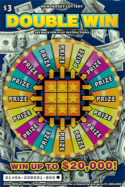
	

</td></tr> </table>

## 7 - $5.00

<table>
<tr><td>

|Prize|% Chance|
| ------------- |:-------------:|
|$5.00 | 9.13643%|
|$10.00 | 9.19064%|
|$20.00 | 1.54289%|
|$25.00 | 0.77667%|
|$40.00 | 0.30972%|
|$50.00 | 0.38812%|
|$100.00 | 0.29318%|
|$400.00 | 0.03856%|
|$1,000.00 | 0.01355%|
|$10,000.00 | 0.00075%|
|$200,000.00 | 0.00006%|

</td><td>

	
	

</td></tr> </table>

## $250,000 Crossword - $10.00

<table>
<tr><td>

|Prize|% Chance|
| ------------- |:-------------:|
|$10.00 | 9.09850%|
|$20.00 | 6.33039%|
|$25.00 | 0.94688%|
|$30.00 | 2.39309%|
|$50.00 | 3.51151%|
|$100.00 | 0.51466%|
|$130.00 | 0.07285%|
|$150.00 | 0.06308%|
|$225.00 | 0.03793%|
|$500.00 | 0.03167%|
|$525.00 | 0.03184%|
|$1,000.00 | 0.00059%|
|$20,000.00 | 0.00027%|
|$250,000.00 | 0.00016%|

</td><td>

	
	

</td></tr> </table>

## Instant Cash Millionaire - $20.00

<table>
<tr><td>

|Prize|% Chance|
| ------------- |:-------------:|
|$20.00 | 7.17940%|
|$30.00 | 2.87673%|
|$50.00 | 2.87900%|
|$100.00 | 2.15278%|
|$150.00 | 0.31323%|
|$200.00 | 0.26479%|
|$500.00 | 0.14682%|
|$1,000.00 | 0.01217%|
|$2,500.00 | 0.00185%|
|$10,000.00 | 0.00062%|
|$50,000.00 | 0.00008%|
|$1,000,000.00 | 0.00003%|

</td><td>

	
	

</td></tr> </table>

## Big Money Spectacular - $2.00

<table>
<tr><td>

|Prize|% Chance|
| ------------- |:-------------:|
|$2.00 | 9.12340%|
|$3.00 | 3.16044%|
|$4.00 | 1.90014%|
|$5.00 | 1.58666%|
|$10.00 | 1.27406%|
|$15.00 | 1.28147%|
|$20.00 | 0.79905%|
|$25.00 | 0.48141%|
|$50.00 | 0.22401%|
|$75.00 | 0.04318%|
|$100.00 | 0.05845%|
|$500.00 | 0.00192%|
|$1,000.00 | 0.00032%|
|$5,000.00 | 0.00003%|
|$30,000.00 | 0.00002%|

</td><td>

	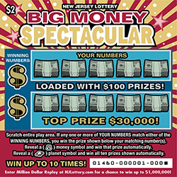
	

</td></tr> </table>

## Mega Crossword - $20.00

<table>
<tr><td>

|Prize|% Chance|
| ------------- |:-------------:|
|$20.00 | 6.86760%|
|$25.00 | 4.73195%|
|$30.00 | 4.72214%|
|$50.00 | 4.74989%|
|$75.00 | 1.33545%|
|$100.00 | 2.38347%|
|$150.00 | 0.55477%|
|$250.00 | 0.14016%|
|$500.00 | 0.26239%|
|$1,000.00 | 0.01416%|
|$2,000.00 | 0.00634%|
|$50,000.00 | 0.00054%|
|$500,000.00 | 0.00009%|

</td><td>

	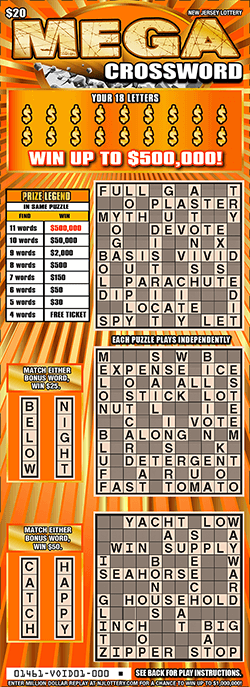
	

</td></tr> </table>

## Big Money Spectacular - $2.00

<table>
<tr><td>

|Prize|% Chance|
| ------------- |:-------------:|
|$2.00 | 8.96901%|
|$3.00 | 3.10617%|
|$4.00 | 1.86932%|
|$5.00 | 1.55978%|
|$10.00 | 1.25502%|
|$15.00 | 1.26064%|
|$20.00 | 0.78587%|
|$25.00 | 0.47363%|
|$50.00 | 0.22058%|
|$75.00 | 0.04296%|
|$100.00 | 0.05767%|
|$500.00 | 0.00191%|
|$1,000.00 | 0.00033%|
|$5,000.00 | 0.00003%|
|$30,000.00 | 0.00003%|

</td><td>

	
	

</td></tr> </table>

## $1,000,000 Spectacular - $10.00

<table>
<tr><td>

|Prize|% Chance|
| ------------- |:-------------:|
|$10.00 | 5.85840%|
|$10.00 | 5.85803%|
|$20.00 | 5.90576%|
|$40.00 | 1.50036%|
|$50.00 | 1.48804%|
|$100.00 | 1.60778%|
|$200.00 | 0.17890%|
|$500.00 | 0.04638%|
|$1,000.00 | 0.00720%|
|$2,000.00 | 0.00205%|
|$10,000.00 | 0.00036%|
|$752,300.00 | 0.00002%|

</td><td>

	
	

</td></tr> </table>

## Loose Change - $1.00

<table>
<tr><td>

|Prize|% Chance|
| ------------- |:-------------:|
|$1.00 | 10.21144%|
|$2.00 | 5.19206%|
|$5.00 | 2.21029%|
|$10.00 | 0.78468%|
|$20.00 | 0.33960%|
|$40.00 | 0.11325%|
|$100.00 | 0.01717%|
|$500.00 | 0.00067%|

</td><td>

	
	

</td></tr> </table>

## Love To Win Doubler - $2.00

<table>
<tr><td>

|Prize|% Chance|
| ------------- |:-------------:|
|$2.00 | 5.71521%|
|$2.00 | 2.84763%|
|$4.00 | 4.04823%|
|$5.00 | 2.88948%|
|$10.00 | 3.54221%|
|$20.00 | 1.18429%|
|$50.00 | 0.06685%|
|$100.00 | 0.01667%|
|$500.00 | 0.00188%|
|$1,000.00 | 0.00036%|
|$20,000.00 | 0.00007%|

</td><td>

	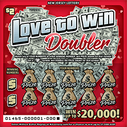
	

</td></tr> </table>

## $500 Frenzy - $5.00

<table>
<tr><td>

|Prize|% Chance|
| ------------- |:-------------:|
|$5.00 | 6.36453%|
|$10.00 | 11.27694%|
|$20.00 | 1.62120%|
|$25.00 | 0.48745%|
|$40.00 | 0.21120%|
|$50.00 | 0.16211%|
|$100.00 | 0.24377%|
|$200.00 | 0.01802%|
|$500.00 | 0.13364%|
|$200,000.00 | 0.00007%|

</td><td>

	
	

</td></tr> </table>

## $20,000 Gold Rush - $2.00

<table>
<tr><td>

|Prize|% Chance|
| ------------- |:-------------:|
|$2.00 | 7.68444%|
|$4.00 | 4.19210%|
|$5.00 | 3.59911%|
|$10.00 | 2.74471%|
|$20.00 | 0.91457%|
|$40.00 | 0.34623%|
|$100.00 | 0.06138%|
|$1,000.00 | 0.00075%|
|$20,000.00 | 0.00008%|

</td><td>

	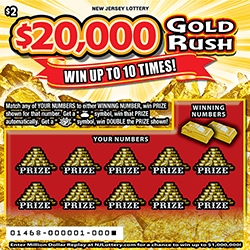
	

</td></tr> </table>

## $200,000 Gold Rush - $5.00

<table>
<tr><td>

|Prize|% Chance|
| ------------- |:-------------:|
|$5.00 | 6.64730%|
|$10.00 | 8.12597%|
|$15.00 | 1.35767%|
|$20.00 | 1.36518%|
|$30.00 | 1.36965%|
|$50.00 | 0.43423%|
|$100.00 | 0.15830%|
|$500.00 | 0.01585%|
|$1,000.00 | 0.00255%|
|$5,000.00 | 0.00048%|
|$200,000.00 | 0.00005%|

</td><td>

	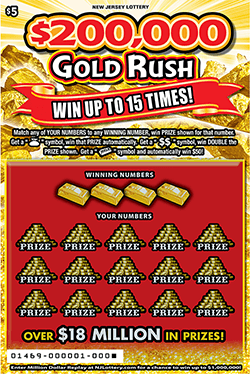
	

</td></tr> </table>

## $1,000,000 Gold Rush - $10.00

<table>
<tr><td>

|Prize|% Chance|
| ------------- |:-------------:|
|$10.00 | 6.42648%|
|$20.00 | 4.33566%|
|$30.00 | 2.17526%|
|$50.00 | 2.18624%|
|$100.00 | 0.65750%|
|$200.00 | 0.06571%|
|$500.00 | 0.01236%|
|$2,000.00 | 0.00127%|
|$5,000.00 | 0.00042%|
|$10,000.00 | 0.00011%|
|$752,300.00 | 0.00004%|

</td><td>

	
	

</td></tr> </table>

## Blackout Bingo - $3.00

<table>
<tr><td>

|Prize|% Chance|
| ------------- |:-------------:|
|$3.00 | 5.90185%|
|$4.00 | 2.94491%|
|$5.00 | 3.70200%|
|$9.00 | 0.77365%|
|$10.00 | 1.11460%|
|$15.00 | 0.77651%|
|$20.00 | 0.74921%|
|$30.00 | 0.48089%|
|$50.00 | 0.28409%|
|$60.00 | 0.03051%|
|$100.00 | 0.14515%|
|$150.00 | 0.02359%|
|$200.00 | 0.00787%|
|$250.00 | 0.00324%|
|$300.00 | 0.00313%|
|$500.00 | 0.00265%|
|$1,000.00 | 0.00121%|
|$20,000.00 | 0.00011%|

</td><td>

	
	

</td></tr> </table>

## Super Crossword - $5.00

<table>
<tr><td>

|Prize|% Chance|
| ------------- |:-------------:|
|$5.00 | 8.76877%|
|$7.00 | 6.52960%|
|$10.00 | 2.17018%|
|$12.00 | 1.57423%|
|$15.00 | 0.31571%|
|$50.00 | 0.51589%|
|$100.00 | 0.64127%|
|$150.00 | 0.47828%|
|$750.00 | 0.00092%|
|$7,500.00 | 0.00029%|
|$50,000.00 | 0.00011%|

</td><td>

	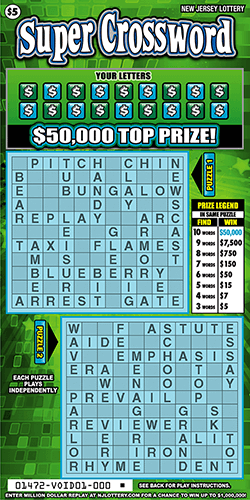
	

</td></tr> </table>

## $250,000 Crossword - $10.00

<table>
<tr><td>

|Prize|% Chance|
| ------------- |:-------------:|
|$10.00 | 9.07620%|
|$20.00 | 6.30880%|
|$25.00 | 0.94722%|
|$30.00 | 2.38277%|
|$50.00 | 3.50250%|
|$100.00 | 0.51305%|
|$130.00 | 0.07236%|
|$150.00 | 0.06243%|
|$225.00 | 0.03793%|
|$500.00 | 0.03232%|
|$525.00 | 0.03205%|
|$1,000.00 | 0.00059%|
|$20,000.00 | 0.00027%|
|$250,000.00 | 0.00016%|

</td><td>

	
	

</td></tr> </table>

## Backstage Pass To Cash - $2.00

<table>
<tr><td>

|Prize|% Chance|
| ------------- |:-------------:|
|$2.00 | 5.76273%|
|$2.00 | 4.11200%|
|$4.00 | 3.77171%|
|$5.00 | 1.26266%|
|$10.00 | 1.27805%|
|$20.00 | 0.64585%|
|$50.00 | 0.20612%|
|$100.00 | 0.04125%|
|$500.00 | 0.00156%|
|$1,000.00 | 0.00016%|
|$3,500.00 | 0.00006%|
|$20,000.00 | 0.00002%|

</td><td>

	
	

</td></tr> </table>

## Lucky Times 20 - $5.00

<table>
<tr><td>

|Prize|% Chance|
| ------------- |:-------------:|
|$5.00 | 7.65771%|
|$10.00 | 5.43187%|
|$15.00 | 2.35905%|
|$20.00 | 3.91668%|
|$25.00 | 1.57344%|
|$50.00 | 0.34741%|
|$100.00 | 0.15974%|
|$200.00 | 0.00770%|
|$500.00 | 0.01165%|
|$2,000.00 | 0.00111%|
|$5,000.00 | 0.00066%|
|$200,000.00 | 0.00005%|

</td><td>

	
	

</td></tr> </table>

## Dazzling Diamond Spectacular - $20.00

<table>
<tr><td>

|Prize|% Chance|
| ------------- |:-------------:|
|$20.00 | 2.65247%|
|$20.00 | 1.34012%|
|$20.00 | 2.66220%|
|$50.00 | 2.68568%|
|$70.00 | 2.70075%|
|$100.00 | 1.49639%|
|$500.00 | 0.23587%|
|$2,000.00 | 0.00818%|
|$10,000.00 | 0.00115%|
|$1,472,200.00 | 0.00003%|

</td><td>

	
	

</td></tr> </table>

## Super Crossword - $5.00

<table>
<tr><td>

|Prize|% Chance|
| ------------- |:-------------:|
|$5.00 | 8.84672%|
|$7.00 | 6.58129%|
|$10.00 | 2.18825%|
|$12.00 | 1.58578%|
|$15.00 | 0.31704%|
|$50.00 | 0.51887%|
|$100.00 | 0.64681%|
|$150.00 | 0.48002%|
|$750.00 | 0.00086%|
|$7,500.00 | 0.00029%|
|$50,000.00 | 0.00011%|

</td><td>

	
	

</td></tr> </table>

## $250,000 Crossword - $10.00

<table>
<tr><td>

|Prize|% Chance|
| ------------- |:-------------:|
|$10.00 | 8.95737%|
|$20.00 | 6.24015%|
|$25.00 | 0.93080%|
|$30.00 | 2.36062%|
|$50.00 | 3.45870%|
|$100.00 | 0.50544%|
|$130.00 | 0.07174%|
|$150.00 | 0.06252%|
|$225.00 | 0.03766%|
|$500.00 | 0.03131%|
|$525.00 | 0.03076%|
|$1,000.00 | 0.00066%|
|$20,000.00 | 0.00028%|
|$250,000.00 | 0.00017%|

</td><td>

	
	

</td></tr> </table>

## Fast Money - $2.00

<table>
<tr><td>

|Prize|% Chance|
| ------------- |:-------------:|
|$2.00 | 7.70530%|
|$4.00 | 4.70244%|
|$5.00 | 4.71477%|
|$10.00 | 1.77707%|
|$20.00 | 0.88937%|
|$40.00 | 0.29973%|
|$100.00 | 0.08563%|
|$500.00 | 0.00288%|
|$1,000.00 | 0.00070%|
|$20,000.00 | 0.00004%|

</td><td>

	
	

</td></tr> </table>

## Loteria - $3.00

<table>
<tr><td>

|Prize|% Chance|
| ------------- |:-------------:|
|$3.00 | 9.81850%|
|$5.00 | 5.41093%|
|$10.00 | 2.72256%|
|$15.00 | 1.85263%|
|$20.00 | 1.36948%|
|$25.00 | 0.42487%|
|$30.00 | 0.09996%|
|$50.00 | 0.15279%|
|$100.00 | 0.03849%|
|$150.00 | 0.02660%|
|$500.00 | 0.01542%|
|$30,000.00 | 0.00004%|

</td><td>

	
	

</td></tr> </table>

## High Card Poker - $5.00

<table>
<tr><td>

|Prize|% Chance|
| ------------- |:-------------:|
|$5.00 | 8.73958%|
|$10.00 | 7.35569%|
|$20.00 | 2.95921%|
|$50.00 | 1.06009%|
|$100.00 | 0.29520%|
|$250.00 | 0.03327%|
|$500.00 | 0.01788%|
|$2,500.00 | 0.00073%|
|$150,000.00 | 0.00006%|

</td><td>

	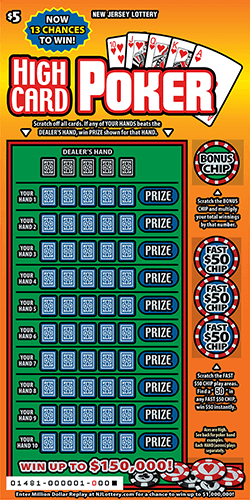
	

</td></tr> </table>

## Jersey Cash Blowout - $10.00

<table>
<tr><td>

|Prize|% Chance|
| ------------- |:-------------:|
|$50.00 | 4.97749%|
|$100.00 | 2.49346%|

</td><td>

	
	

</td></tr> </table>

## Pink Diamond Bingo - $5.00

<table>
<tr><td>

|Prize|% Chance|
| ------------- |:-------------:|
|$5.00 | 10.57788%|
|$10.00 | 6.08974%|
|$20.00 | 3.04322%|
|$50.00 | 1.16076%|
|$75.00 | 0.25922%|
|$100.00 | 0.14070%|
|$200.00 | 0.03903%|
|$400.00 | 0.00645%|
|$500.00 | 0.01209%|
|$1,500.00 | 0.00263%|
|$5,000.00 | 0.00063%|
|$30,000.00 | 0.00006%|
|$100,000.00 | 0.00002%|

</td><td>

	
	

</td></tr> </table>

## Ruby Red Riches - $5.00

<table>
<tr><td>

|Prize|% Chance|
| ------------- |:-------------:|
|$5.00 | 4.80833%|
|$10.00 | 5.86925%|
|$15.00 | 0.98852%|
|$20.00 | 1.48512%|
|$50.00 | 0.64960%|
|$100.00 | 0.13278%|
|$500.00 | 0.01167%|
|$1,000.00 | 0.00192%|
|$5,000.00 | 0.00042%|
|$200,000.00 | 0.00005%|

</td><td>

	
	

</td></tr> </table>

## $5,000,000 Lucky 7s - $30.00

<table>
<tr><td>

|Prize|% Chance|
| ------------- |:-------------:|
|$30.00 | 6.56952%|
|$50.00 | 5.79312%|
|$75.00 | 1.65520%|
|$100.00 | 3.70857%|
|$175.00 | 1.00858%|
|$500.00 | 0.33181%|
|$2,500.00 | 0.02073%|
|$5,000.00 | 0.00207%|
|$10,000.00 | 0.00021%|
|$70,000.00 | 0.00009%|
|$3,654,400.00 | 0.00001%|

</td><td>

	
	

</td></tr> </table>

## Big Money Spectacular - $2.00

<table>
<tr><td>

|Prize|% Chance|
| ------------- |:-------------:|
|$2.00 | 9.07699%|
|$3.00 | 3.14412%|
|$4.00 | 1.89239%|
|$5.00 | 1.58010%|
|$10.00 | 1.27026%|
|$15.00 | 1.27575%|
|$20.00 | 0.79664%|
|$25.00 | 0.47950%|
|$50.00 | 0.22377%|
|$75.00 | 0.04354%|
|$100.00 | 0.05854%|
|$500.00 | 0.00197%|
|$1,000.00 | 0.00035%|
|$5,000.00 | 0.00003%|
|$30,000.00 | 0.00004%|

</td><td>

	
	

</td></tr> </table>

## Summer Lucky Times 10 - $2.00

<table>
<tr><td>

|Prize|% Chance|
| ------------- |:-------------:|
|$2.00 | 5.75587%|
|$2.00 | 3.44613%|
|$4.00 | 5.81007%|
|$5.00 | 1.75333%|
|$10.00 | 2.36484%|
|$20.00 | 1.18726%|
|$50.00 | 0.18879%|
|$100.00 | 0.04596%|
|$500.00 | 0.00300%|
|$1,000.00 | 0.00039%|
|$20,000.00 | 0.00009%|

</td><td>

	
	

</td></tr> </table>

## Wild Time Multiplier - $5.00

<table>
<tr><td>

|Prize|% Chance|
| ------------- |:-------------:|
|$5.00 | 5.88977%|
|$10.00 | 4.07099%|
|$20.00 | 2.15708%|
|$25.00 | 0.84517%|
|$50.00 | 0.34235%|
|$75.00 | 0.21878%|
|$100.00 | 0.14209%|
|$500.00 | 0.01345%|
|$2,500.00 | 0.00320%|
|$150,000.00 | 0.00005%|

</td><td>

	
	

</td></tr> </table>

## Hot Riches - $10.00

<table>
<tr><td>

|Prize|% Chance|
| ------------- |:-------------:|
|$10.00 | 10.19932%|
|$20.00 | 5.88646%|
|$25.00 | 1.46520%|
|$40.00 | 1.47762%|
|$50.00 | 2.96517%|
|$100.00 | 0.56909%|
|$200.00 | 0.09522%|
|$500.00 | 0.02176%|
|$1,000.00 | 0.00163%|
|$2,500.00 | 0.00121%|
|$10,000.00 | 0.00016%|
|$500,000.00 | 0.00007%|

</td><td>

	
	

</td></tr> </table>

## Big Money Spectacular - $2.00

<table>
<tr><td>

|Prize|% Chance|
| ------------- |:-------------:|
|$2.00 | 8.82433%|
|$3.00 | 3.06272%|
|$4.00 | 1.84358%|
|$5.00 | 1.54118%|
|$10.00 | 1.24044%|
|$15.00 | 1.24876%|
|$20.00 | 0.77844%|
|$25.00 | 0.46946%|
|$50.00 | 0.21848%|
|$75.00 | 0.04251%|
|$100.00 | 0.05731%|
|$500.00 | 0.00190%|
|$1,000.00 | 0.00032%|
|$5,000.00 | 0.00003%|
|$30,000.00 | 0.00003%|

</td><td>

	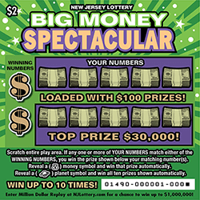
	

</td></tr> </table>

## Win For Life - $3.00

<table>
<tr><td>

|Prize|% Chance|
| ------------- |:-------------:|
|$3.00 | 4.08748%|
|$3.00 | 4.03995%|
|$5.00 | 2.46138%|
|$10.00 | 3.38599%|
|$15.00 | 0.42661%|
|$20.00 | 1.71036%|
|$30.00 | 0.55968%|
|$40.00 | 0.21586%|
|$100.00 | 0.08607%|
|$200.00 | 0.00645%|
|$1,000.00 | 0.00029%|
|$5,000.00 | 0.00012%|
|$1,100,000.00 | 0.00002%|

</td><td>

	
	

</td></tr> </table>

## Million Dollar Multiplier - $10.00

<table>
<tr><td>

|Prize|% Chance|
| ------------- |:-------------:|
|$10.00 | 11.25618%|
|$20.00 | 6.83989%|
|$50.00 | 3.04649%|
|$100.00 | 1.03007%|
|$200.00 | 0.22204%|
|$500.00 | 0.04568%|
|$1,000.00 | 0.00249%|
|$5,000.00 | 0.00024%|
|$711,700.00 | 0.00004%|

</td><td>

	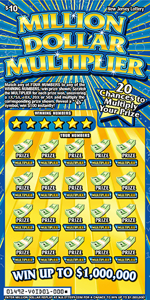
	

</td></tr> </table>

## $250,000 Crossword - $10.00

<table>
<tr><td>

|Prize|% Chance|
| ------------- |:-------------:|
|$10.00 | 8.99157%|
|$20.00 | 6.25626%|
|$25.00 | 0.93758%|
|$30.00 | 2.36197%|
|$50.00 | 3.47551%|
|$100.00 | 0.50537%|
|$130.00 | 0.07133%|
|$150.00 | 0.06238%|
|$225.00 | 0.03815%|
|$500.00 | 0.03167%|
|$525.00 | 0.03151%|
|$1,000.00 | 0.00059%|
|$20,000.00 | 0.00027%|
|$250,000.00 | 0.00016%|

</td><td>

	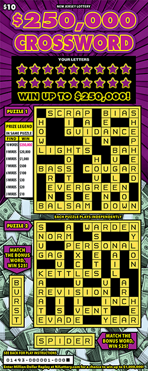
	

</td></tr> </table>

## Loose Change - $1.00

<table>
<tr><td>

|Prize|% Chance|
| ------------- |:-------------:|
|$1.00 | 10.36492%|
|$2.00 | 5.28857%|
|$5.00 | 2.25032%|
|$10.00 | 0.79973%|
|$20.00 | 0.34368%|
|$40.00 | 0.11493%|
|$100.00 | 0.01775%|
|$500.00 | 0.00073%|

</td><td>

	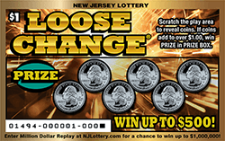
	

</td></tr> </table>

## Crossword - $3.00

<table>
<tr><td>

|Prize|% Chance|
| ------------- |:-------------:|
|$3.00 | 6.19242%|
|$5.00 | 5.70452%|
|$10.00 | 4.05117%|
|$25.00 | 2.91049%|
|$100.00 | 0.22545%|
|$500.00 | 0.00012%|
|$5,000.00 | 0.00016%|
|$20,000.00 | 0.00014%|

</td><td>

	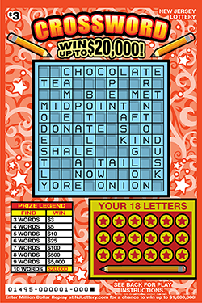
	

</td></tr> </table>

## Super Tic Tac Toe - $3.00

<table>
<tr><td>

|Prize|% Chance|
| ------------- |:-------------:|
|$3.00 | 6.78445%|
|$5.00 | 4.40540%|
|$10.00 | 2.07684%|
|$15.00 | 1.04611%|
|$20.00 | 0.70109%|
|$30.00 | 0.35154%|
|$50.00 | 0.26281%|
|$100.00 | 0.10688%|
|$200.00 | 0.01606%|
|$500.00 | 0.00879%|
|$1,000.00 | 0.00306%|
|$30,000.00 | 0.00006%|

</td><td>

	
	

</td></tr> </table>

## Lady Luck Bonus - $5.00

<table>
<tr><td>

|Prize|% Chance|
| ------------- |:-------------:|
|$5.00 | 4.98336%|
|$10.00 | 4.55530%|
|$15.00 | 1.01402%|
|$20.00 | 3.07505%|
|$50.00 | 0.39263%|
|$100.00 | 0.12841%|
|$200.00 | 0.01260%|
|$500.00 | 0.00736%|
|$2,000.00 | 0.00080%|
|$5,000.00 | 0.00048%|
|$200,000.00 | 0.00004%|

</td><td>

	
	

</td></tr> </table>

## $250,000 Crossword - $10.00

<table>
<tr><td>

|Prize|% Chance|
| ------------- |:-------------:|
|$10.00 | 8.97006%|
|$20.00 | 6.24979%|
|$25.00 | 0.93654%|
|$30.00 | 2.36361%|
|$50.00 | 3.46682%|
|$100.00 | 0.50628%|
|$130.00 | 0.07171%|
|$150.00 | 0.06130%|
|$225.00 | 0.03809%|
|$500.00 | 0.03097%|
|$525.00 | 0.03081%|
|$1,000.00 | 0.00059%|
|$20,000.00 | 0.00027%|
|$250,000.00 | 0.00011%|

</td><td>

	
	

</td></tr> </table>

## Crossword - $3.00

<table>
<tr><td>

|Prize|% Chance|
| ------------- |:-------------:|
|$3.00 | 3.86126%|
|$5.00 | 3.56491%|
|$10.00 | 2.53096%|
|$25.00 | 1.82179%|
|$100.00 | 0.14200%|
|$500.00 | 0.00008%|
|$5,000.00 | 0.00007%|
|$20,000.00 | 0.00006%|

</td><td>

	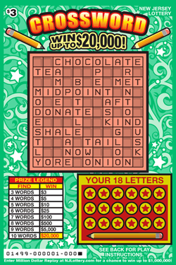
	

</td></tr> </table>

## Money Roll - $2.00

<table>
<tr><td>

|Prize|% Chance|
| ------------- |:-------------:|
|$2.00 | 6.76724%|
|$4.00 | 6.86542%|
|$5.00 | 2.28439%|
|$10.00 | 2.33786%|
|$20.00 | 1.02452%|
|$40.00 | 0.25987%|
|$100.00 | 0.04276%|
|$500.00 | 0.00338%|
|$1,000.00 | 0.00026%|
|$20,000.00 | 0.00008%|

</td><td>

	
	

</td></tr> </table>

## Bingo Times 10 - $5.00

<table>
<tr><td>

|Prize|% Chance|
| ------------- |:-------------:|
|$5.00 | 7.86616%|
|$10.00 | 5.99778%|
|$20.00 | 3.01348%|
|$50.00 | 0.84110%|
|$75.00 | 0.21816%|
|$100.00 | 0.12078%|
|$200.00 | 0.02735%|
|$400.00 | 0.01279%|
|$500.00 | 0.00427%|
|$1,500.00 | 0.00051%|
|$5,000.00 | 0.00026%|
|$10,000.00 | 0.00009%|
|$50,000.00 | 0.00009%|
|$100,000.00 | 0.00007%|

</td><td>

	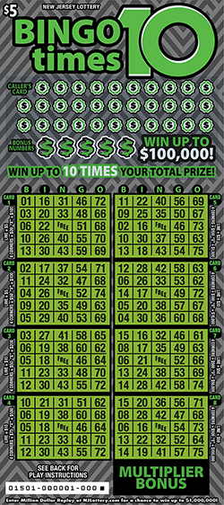
	

</td></tr> </table>

## Money Match - $5.00

<table>
<tr><td>

|Prize|% Chance|
| ------------- |:-------------:|
|$5.00 | 4.63346%|
|$10.00 | 5.67373%|
|$15.00 | 0.94824%|
|$20.00 | 0.95260%|
|$30.00 | 0.95803%|
|$50.00 | 0.22973%|
|$100.00 | 0.16227%|
|$500.00 | 0.01022%|
|$1,000.00 | 0.00084%|
|$5,000.00 | 0.00029%|
|$200,000.00 | 0.00002%|

</td><td>

	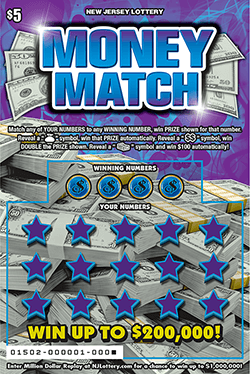
	

</td></tr> </table>

## $20,000 Lucky 7s - $2.00

<table>
<tr><td>

|Prize|% Chance|
| ------------- |:-------------:|
|$2.00 | 8.79485%|
|$4.00 | 3.57193%|
|$5.00 | 2.37547%|
|$10.00 | 2.42288%|
|$20.00 | 1.67780%|
|$50.00 | 0.24063%|
|$100.00 | 0.02694%|
|$500.00 | 0.00382%|
|$1,000.00 | 0.00143%|
|$20,000.00 | 0.00004%|

</td><td>

	
	

</td></tr> </table>

## $200,000 Lucky 7s - $5.00

<table>
<tr><td>

|Prize|% Chance|
| ------------- |:-------------:|
|$5.00 | 6.56485%|
|$10.00 | 8.06108%|
|$20.00 | 2.71600%|
|$30.00 | 0.20443%|
|$50.00 | 0.68449%|
|$100.00 | 0.26049%|
|$500.00 | 0.03010%|
|$2,000.00 | 0.00122%|
|$5,000.00 | 0.00064%|
|$200,000.00 | 0.00003%|

</td><td>

	
	

</td></tr> </table>

## $1,000,000 Lucky 7s - $10.00

<table>
<tr><td>

|Prize|% Chance|
| ------------- |:-------------:|
|$10.00 | 7.38770%|
|$20.00 | 5.35436%|
|$30.00 | 1.07226%|
|$50.00 | 2.15978%|
|$100.00 | 0.73630%|
|$200.00 | 0.01616%|
|$500.00 | 0.02617%|
|$2,000.00 | 0.00047%|
|$10,000.00 | 0.00025%|
|$720,100.00 | 0.00000%|

</td><td>

	
	

</td></tr> </table>

## $2,000,000 Lucky 7s - $20.00

<table>
<tr><td>

|Prize|% Chance|
| ------------- |:-------------:|
|$20.00 | 3.36138%|
|$30.00 | 1.68980%|
|$50.00 | 2.54610%|
|$100.00 | 1.13613%|
|$200.00 | 0.23427%|
|$500.00 | 0.12791%|
|$2,000.00 | 0.00365%|
|$10,000.00 | 0.00028%|
|$1,440,100.00 | 0.00001%|

</td><td>

	
	

</td></tr> </table>

## Loose Change - $1.00

<table>
<tr><td>

|Prize|% Chance|
| ------------- |:-------------:|
|$1.00 | 10.41159%|
|$2.00 | 5.30899%|
|$5.00 | 2.26592%|
|$10.00 | 0.80467%|
|$20.00 | 0.34591%|
|$40.00 | 0.11618%|
|$100.00 | 0.01759%|
|$500.00 | 0.00075%|

</td><td>

	
	

</td></tr> </table>

## Bingo Plus - $3.00

<table>
<tr><td>

|Prize|% Chance|
| ------------- |:-------------:|
|$3.00 | 4.22553%|
|$4.00 | 4.19162%|
|$5.00 | 2.62815%|
|$7.00 | 0.55635%|
|$9.00 | 0.55458%|
|$10.00 | 1.06104%|
|$25.00 | 0.49939%|
|$50.00 | 0.13400%|
|$75.00 | 0.04619%|
|$100.00 | 0.05533%|
|$150.00 | 0.02990%|
|$200.00 | 0.01159%|
|$500.00 | 0.00447%|
|$1,000.00 | 0.00090%|
|$20,000.00 | 0.00010%|

</td><td>

	
	

</td></tr> </table>

## Super Crossword - $5.00

<table>
<tr><td>

|Prize|% Chance|
| ------------- |:-------------:|
|$5.00 | 8.82672%|
|$7.00 | 6.56227%|
|$10.00 | 2.18266%|
|$12.00 | 1.58230%|
|$15.00 | 0.31823%|
|$50.00 | 0.51661%|
|$100.00 | 0.64379%|
|$150.00 | 0.47917%|
|$750.00 | 0.00083%|
|$7,500.00 | 0.00027%|
|$50,000.00 | 0.00011%|

</td><td>

	
	

</td></tr> </table>

## The Voice - $5.00

<table>
<tr><td>

|Prize|% Chance|
| ------------- |:-------------:|
|$5.00 | 2.56064%|
|$10.00 | 1.95616%|
|$20.00 | 0.88132%|
|$30.00 | 0.37194%|
|$50.00 | 0.13062%|
|$75.00 | 0.05316%|
|$100.00 | 0.05790%|
|$500.00 | 0.00599%|
|$2,000.00 | 0.00097%|
|$100,000.00 | 0.00002%|

</td><td>

	
	

</td></tr> </table>

## Loose Change - $1.00

<table>
<tr><td>

|Prize|% Chance|
| ------------- |:-------------:|
|$1.00 | 10.24613%|
|$2.00 | 5.21798%|
|$5.00 | 2.23032%|
|$10.00 | 0.78989%|
|$20.00 | 0.34078%|
|$40.00 | 0.11352%|
|$100.00 | 0.01690%|
|$500.00 | 0.00075%|

</td><td>

	
	

</td></tr> </table>

## $500 Frenzy - $5.00

<table>
<tr><td>

|Prize|% Chance|
| ------------- |:-------------:|
|$5.00 | 5.55320%|
|$10.00 | 9.87239%|
|$20.00 | 1.42174%|
|$25.00 | 0.42603%|
|$40.00 | 0.18675%|
|$50.00 | 0.14274%|
|$100.00 | 0.21536%|
|$200.00 | 0.01576%|
|$500.00 | 0.11768%|
|$200,000.00 | 0.00004%|

</td><td>

	
	

</td></tr> </table>

## Cash Blast - $10.00

<table>
<tr><td>

|Prize|% Chance|
| ------------- |:-------------:|
|$20.00 | 3.49765%|
|$25.00 | 1.16768%|
|$40.00 | 1.75992%|
|$50.00 | 1.17620%|
|$100.00 | 1.76729%|
|$200.00 | 0.17703%|
|$500.00 | 0.03543%|

</td><td>

	
	

</td></tr> </table>

## Holiday Loose Change - $1.00

<table>
<tr><td>

|Prize|% Chance|
| ------------- |:-------------:|
|$1.00 | 9.07125%|
|$2.00 | 4.64784%|
|$5.00 | 2.01775%|
|$10.00 | 0.72521%|
|$20.00 | 0.31775%|
|$40.00 | 0.10840%|
|$100.00 | 0.01656%|
|$500.00 | 0.00071%|

</td><td>

	
	

</td></tr> </table>

## Holiday Lucky Times 10 - $2.00

<table>
<tr><td>

|Prize|% Chance|
| ------------- |:-------------:|
|$2.00 | 4.81720%|
|$2.00 | 2.88266%|
|$4.00 | 4.87676%|
|$5.00 | 1.48484%|
|$10.00 | 2.01762%|
|$20.00 | 1.02841%|
|$50.00 | 0.16605%|
|$100.00 | 0.03937%|
|$500.00 | 0.00259%|
|$1,000.00 | 0.00030%|
|$20,000.00 | 0.00008%|

</td><td>

	
	

</td></tr> </table>

## Holiday Bucks - $5.00

<table>
<tr><td>

|Prize|% Chance|
| ------------- |:-------------:|
|$5.00 | 6.68703%|
|$10.00 | 8.82536%|
|$20.00 | 2.81599%|
|$50.00 | 0.40432%|
|$100.00 | 0.32472%|
|$500.00 | 0.04380%|
|$1,000.00 | 0.00346%|
|$5,000.00 | 0.00055%|
|$200,000.00 | 0.00006%|

</td><td>

	
	

</td></tr> </table>

## $1,000,000 Spectacular - $10.00

<table>
<tr><td>

|Prize|% Chance|
| ------------- |:-------------:|
|$10.00 | 2.60075%|
|$10.00 | 2.59594%|
|$20.00 | 3.29003%|
|$50.00 | 0.66335%|
|$100.00 | 0.73394%|
|$200.00 | 0.08627%|
|$500.00 | 0.03520%|
|$1,000.00 | 0.00348%|
|$2,000.00 | 0.00104%|
|$10,000.00 | 0.00023%|
|$752,300.00 | 0.00000%|

</td><td>

	
	

</td></tr> </table>

## Fast Cash - $2.00

<table>
<tr><td>

|Prize|% Chance|
| ------------- |:-------------:|
|$2.00 | 6.09752%|
|$4.00 | 3.72435%|
|$5.00 | 3.75137%|
|$10.00 | 1.41222%|
|$20.00 | 0.71502%|
|$40.00 | 0.24039%|
|$100.00 | 0.07077%|
|$500.00 | 0.00242%|
|$1,000.00 | 0.00054%|
|$20,000.00 | 0.00004%|

</td><td>

	
	

</td></tr> </table>

## $3,000,000 Cash Out - $25.00

<table>
<tr><td>

|Prize|% Chance|
| ------------- |:-------------:|
|$40.00 | 2.13348%|
|$60.00 | 1.06739%|
|$100.00 | 0.80404%|
|$200.00 | 0.30328%|
|$500.00 | 0.11649%|
|$2,000.00 | 0.00313%|
|$5,000.00 | 0.00082%|
|$10,000.00 | 0.00007%|
|$50,000.00 | 0.00003%|
|$2,158,000.00 | 0.00001%|

</td><td>

	
	

</td></tr> </table>

## Money Multiplier - $2.00

<table>
<tr><td>

|Prize|% Chance|
| ------------- |:-------------:|
|$2.00 | 4.50030%|
|$4.00 | 2.66175%|
|$5.00 | 2.29434%|
|$10.00 | 1.94388%|
|$20.00 | 0.59040%|
|$50.00 | 0.19844%|
|$100.00 | 0.03247%|
|$1,000.00 | 0.00034%|
|$20,000.00 | 0.00002%|

</td><td>

	
	

</td></tr> </table>

## Loose Change - $1.00

<table>
<tr><td>

|Prize|% Chance|
| ------------- |:-------------:|
|$1.00 | 8.80634%|
|$2.00 | 4.51337%|
|$5.00 | 1.94115%|
|$10.00 | 0.69703%|
|$20.00 | 0.30264%|
|$40.00 | 0.10278%|
|$100.00 | 0.01565%|
|$500.00 | 0.00060%|

</td><td>

	
	

</td></tr> </table>

## Diamonds and Dollars - $5.00

<table>
<tr><td>

|Prize|% Chance|
| ------------- |:-------------:|
|$5.00 | 1.93922%|
|$10.00 | 2.36550%|
|$15.00 | 0.39694%|
|$20.00 | 0.79871%|
|$50.00 | 0.10121%|
|$100.00 | 0.06504%|
|$200.00 | 0.01256%|
|$500.00 | 0.00622%|
|$2,000.00 | 0.00018%|
|$10,000.00 | 0.00008%|
|$200,000.00 | 0.00000%|

</td><td>

	
	

</td></tr> </table>

## $150K Poker Riches - $5.00

<table>
<tr><td>

|Prize|% Chance|
| ------------- |:-------------:|
|$5.00 | 4.38492%|
|$10.00 | 3.70283%|
|$20.00 | 1.49436%|
|$50.00 | 0.53642%|
|$100.00 | 0.15007%|
|$250.00 | 0.01648%|
|$500.00 | 0.00940%|
|$2,500.00 | 0.00028%|
|$150,000.00 | 0.00002%|

</td><td>

	
	

</td></tr> </table>

## Birthday Surprise - $2.00

<table>
<tr><td>

|Prize|% Chance|
| ------------- |:-------------:|
|$2.00 | 1.74083%|
|$2.00 | 1.71553%|
|$4.00 | 1.97797%|
|$5.00 | 0.66585%|
|$10.00 | 0.45334%|
|$20.00 | 0.46243%|
|$25.00 | 0.12310%|
|$50.00 | 0.05006%|
|$100.00 | 0.02731%|
|$500.00 | 0.00295%|
|$1,000.00 | 0.00019%|
|$25,000.00 | 0.00003%|

</td><td>

	
	

</td></tr> </table>

## Loteria - $3.00

<table>
<tr><td>

|Prize|% Chance|
| ------------- |:-------------:|
|$3.00 | 6.88450%|
|$5.00 | 3.79532%|
|$10.00 | 1.91956%|
|$15.00 | 1.30516%|
|$20.00 | 0.96542%|
|$25.00 | 0.29988%|
|$30.00 | 0.07020%|
|$50.00 | 0.10800%|
|$100.00 | 0.02747%|
|$150.00 | 0.01905%|
|$500.00 | 0.01053%|
|$30,000.00 | 0.00004%|

</td><td>

	
	

</td></tr> </table>

## Super Crossword - $5.00

<table>
<tr><td>

|Prize|% Chance|
| ------------- |:-------------:|
|$5.00 | 4.58173%|
|$7.00 | 3.39995%|
|$10.00 | 1.13005%|
|$12.00 | 0.82103%|
|$15.00 | 0.16375%|
|$50.00 | 0.26827%|
|$100.00 | 0.33705%|
|$150.00 | 0.25023%|
|$750.00 | 0.00025%|
|$7,500.00 | 0.00009%|
|$50,000.00 | 0.00000%|

</td><td>

	
	

</td></tr> </table>

## Mega Crossword - $20.00

<table>
<tr><td>

|Prize|% Chance|
| ------------- |:-------------:|
|$20.00 | 0.33660%|
|$25.00 | 0.23657%|
|$30.00 | 0.22911%|
|$50.00 | 0.23994%|
|$75.00 | 0.06461%|
|$100.00 | 0.11932%|
|$150.00 | 0.02918%|
|$250.00 | 0.00742%|
|$500.00 | 0.01277%|
|$1,000.00 | 0.00000%|
|$2,000.00 | 0.00000%|
|$50,000.00 | 0.00000%|
|$500,000.00 | 0.00000%|

</td><td>

	
	

</td></tr> </table>

## $250,000 Crossword - $10.00

<table>
<tr><td>

|Prize|% Chance|
| ------------- |:-------------:|
|$10.00 | 8.73613%|
|$20.00 | 6.06599%|
|$25.00 | 0.90899%|
|$30.00 | 2.29448%|
|$50.00 | 3.37220%|
|$100.00 | 0.49167%|
|$130.00 | 0.06791%|
|$150.00 | 0.05977%|
|$225.00 | 0.03625%|
|$500.00 | 0.03041%|
|$525.00 | 0.03002%|
|$1,000.00 | 0.00055%|
|$20,000.00 | 0.00022%|
|$250,000.00 | 0.00016%|

</td><td>

	
	

</td></tr> </table>

## Win For Life! - $3.00

<table>
<tr><td>

|Prize|% Chance|
| ------------- |:-------------:|
|$3.00 | 0.09921%|
|$3.00 | 0.09797%|
|$5.00 | 0.06046%|
|$10.00 | 0.08387%|
|$15.00 | 0.01027%|
|$20.00 | 0.04304%|
|$30.00 | 0.01419%|
|$40.00 | 0.00564%|
|$100.00 | 0.00228%|
|$200.00 | 0.00013%|
|$1,000.00 | 0.00000%|
|$5,000.00 | 0.00000%|
|$1,060,000.00 | 0.00000%|

</td><td>

	
	

</td></tr> </table>

## $8,000,000 Copper Payout - $2.00

<table>
<tr><td>

|Prize|% Chance|
| ------------- |:-------------:|
|$2.00 | 2.12882%|
|$4.00 | 1.26039%|
|$5.00 | 1.08327%|
|$10.00 | 0.92817%|
|$20.00 | 0.37253%|
|$50.00 | 0.07404%|
|$100.00 | 0.00691%|
|$500.00 | 0.00062%|
|$20,000.00 | 0.00000%|

</td><td>

	
	

</td></tr> </table>

## $18,000,000 Silver Payout - $5.00

<table>
<tr><td>

|Prize|% Chance|
| ------------- |:-------------:|
|$5.00 | 1.48857%|
|$10.00 | 2.29024%|
|$20.00 | 1.35974%|
|$50.00 | 0.15360%|
|$100.00 | 0.05885%|
|$500.00 | 0.00208%|
|$2,000.00 | 0.00007%|
|$5,000.00 | 0.00005%|
|$200,000.00 | 0.00000%|

</td><td>

	
	

</td></tr> </table>

## $52,000,000 Gold Payout - $10.00

<table>
<tr><td>

|Prize|% Chance|
| ------------- |:-------------:|
|$10.00 | 1.51195%|
|$20.00 | 0.87696%|
|$30.00 | 0.22111%|
|$50.00 | 0.50244%|
|$100.00 | 0.17483%|
|$200.00 | 0.00387%|
|$500.00 | 0.00577%|
|$2,000.00 | 0.00001%|
|$10,000.00 | 0.00002%|
|$713,400.00 | 0.00000%|

</td><td>

	
	

</td></tr> </table>

## $90,000,000 Platinum Payout - $20.00

<table>
<tr><td>

|Prize|% Chance|
| ------------- |:-------------:|
|$20.00 | 1.01631%|
|$40.00 | 0.51317%|
|$50.00 | 0.64604%|
|$100.00 | 0.34220%|
|$200.00 | 0.08624%|
|$500.00 | 0.03429%|
|$2,000.00 | 0.00039%|
|$5,000.00 | 0.00000%|
|$10,000.00 | 0.00001%|
|$50,000.00 | 0.00000%|
|$1,426,800.00 | 0.00000%|

</td><td>

	
	

</td></tr> </table>

## Quick $50s - $2.00

<table>
<tr><td>

|Prize|% Chance|
| ------------- |:-------------:|
|$2.00 | 4.99951%|
|$5.00 | 4.70033%|
|$10.00 | 2.18763%|
|$20.00 | 0.19976%|
|$50.00 | 0.29741%|
|$100.00 | 0.02450%|
|$200.00 | 0.00258%|
|$1,000.00 | 0.00025%|
|$20,000.00 | 0.00004%|

</td><td>

	
	

</td></tr> </table>

## Super Money Multiplier - $5.00

<table>
<tr><td>

|Prize|% Chance|
| ------------- |:-------------:|
|$5.00 | 0.50661%|
|$10.00 | 0.52250%|
|$20.00 | 0.13225%|
|$50.00 | 0.06612%|
|$100.00 | 0.01210%|
|$500.00 | 0.00231%|
|$2,000.00 | 0.00000%|
|$5,000.00 | 0.00000%|
|$100,000.00 | 0.00000%|

</td><td>

	
	

</td></tr> </table>

## Lucky Times 50 - $10.00

<table>
<tr><td>

|Prize|% Chance|
| ------------- |:-------------:|
|$10.00 | 0.00000%|
|$20.00 | 0.00000%|
|$50.00 | 0.00000%|
|$100.00 | 0.00000%|
|$200.00 | 0.00000%|
|$500.00 | 0.00000%|
|$2,000.00 | 0.00000%|
|$10,000.00 | 0.00000%|
|$695,900.00 | 0.00000%|

</td><td>

	
	

</td></tr> </table>

## Bingo Bonus Square - $5.00

<table>
<tr><td>

|Prize|% Chance|
| ------------- |:-------------:|
|$5.00 | 3.04820%|
|$10.00 | 1.76891%|
|$20.00 | 0.89004%|
|$50.00 | 0.33824%|
|$75.00 | 0.07540%|
|$100.00 | 0.04162%|
|$200.00 | 0.01176%|
|$400.00 | 0.00192%|
|$500.00 | 0.00389%|
|$1,500.00 | 0.00032%|
|$5,000.00 | 0.00013%|
|$30,000.00 | 0.00000%|
|$100,000.00 | 0.00000%|

</td><td>

	
	

</td></tr> </table>

## Big Money Spectacular - $2.00

<table>
<tr><td>

|Prize|% Chance|
| ------------- |:-------------:|
|$2.00 | 3.77085%|
|$3.00 | 1.30724%|
|$4.00 | 0.78779%|
|$5.00 | 0.65969%|
|$10.00 | 0.53292%|
|$15.00 | 0.53514%|
|$20.00 | 0.33586%|
|$25.00 | 0.20214%|
|$50.00 | 0.09439%|
|$75.00 | 0.01856%|
|$100.00 | 0.02477%|
|$500.00 | 0.00081%|
|$1,000.00 | 0.00006%|
|$5,000.00 | 0.00002%|
|$30,000.00 | 0.00001%|

</td><td>

	
	

</td></tr> </table>

## Money Roll - $2.00

<table>
<tr><td>

|Prize|% Chance|
| ------------- |:-------------:|
|$2.00 | 0.50458%|
|$4.00 | 0.52002%|
|$5.00 | 0.17202%|
|$10.00 | 0.17715%|
|$20.00 | 0.07802%|
|$40.00 | 0.02001%|
|$100.00 | 0.00347%|
|$500.00 | 0.00023%|
|$1,000.00 | 0.00000%|
|$20,000.00 | 0.00000%|

</td><td>

	
	

</td></tr> </table>

## $250,000 Crossword - $10.00

<table>
<tr><td>

|Prize|% Chance|
| ------------- |:-------------:|
|$10.00 | 4.15007%|
|$20.00 | 2.89912%|
|$25.00 | 0.43492%|
|$30.00 | 1.09615%|
|$50.00 | 1.61702%|
|$100.00 | 0.23624%|
|$130.00 | 0.03367%|
|$150.00 | 0.02989%|
|$225.00 | 0.01856%|
|$500.00 | 0.01516%|
|$525.00 | 0.01473%|
|$1,000.00 | 0.00005%|
|$20,000.00 | 0.00000%|
|$250,000.00 | 0.00005%|

</td><td>

	
	

</td></tr> </table>

## Double Dollar Bingo - $3.00

<table>
<tr><td>

|Prize|% Chance|
| ------------- |:-------------:|
|$3.00 | 0.00000%|
|$4.00 | 0.00000%|
|$5.00 | 0.00000%|
|$9.00 | 0.00000%|
|$10.00 | 0.00000%|
|$20.00 | 0.00000%|
|$30.00 | 0.00000%|
|$50.00 | 0.00000%|
|$60.00 | 0.00000%|
|$100.00 | 0.00000%|
|$150.00 | 0.00000%|
|$200.00 | 0.00000%|
|$250.00 | 0.00000%|
|$300.00 | 0.00000%|
|$500.00 | 0.00000%|
|$1,000.00 | 0.00000%|
|$20,000.00 | 0.00000%|

</td><td>

	
	

</td></tr> </table>

## $500 Frenzy - $5.00

<table>
<tr><td>

|Prize|% Chance|
| ------------- |:-------------:|
|$5.00 | 0.00000%|
|$10.00 | 0.00000%|
|$20.00 | 0.00000%|
|$25.00 | 0.00000%|
|$40.00 | 0.00000%|
|$50.00 | 0.00000%|
|$100.00 | 0.00000%|
|$200.00 | 0.00000%|
|$500.00 | 0.00000%|
|$200,000.00 | 0.00000%|

</td><td>

	
	

</td></tr> </table>

## Loose Change - $1.00

<table>
<tr><td>

|Prize|% Chance|
| ------------- |:-------------:|
|$1.00 | 0.82948%|
|$2.00 | 0.43142%|
|$5.00 | 0.18716%|
|$10.00 | 0.06536%|
|$20.00 | 0.02939%|
|$40.00 | 0.00975%|
|$100.00 | 0.00159%|
|$500.00 | 0.00006%|

</td><td>

	
	

</td></tr> </table>

## Fast Money - $2.00

<table>
<tr><td>

|Prize|% Chance|
| ------------- |:-------------:|
|$2.00 | 0.00000%|
|$4.00 | 0.00000%|
|$5.00 | 0.00000%|
|$10.00 | 0.00000%|
|$20.00 | 0.00000%|
|$40.00 | 0.00000%|
|$100.00 | 0.00000%|
|$500.00 | 0.00000%|
|$1,000.00 | 0.00000%|
|$20,000.00 | 0.00000%|

</td><td>

	
	

</td></tr> </table>

